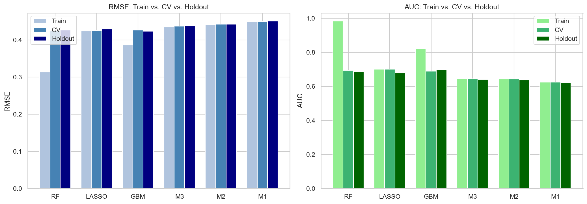
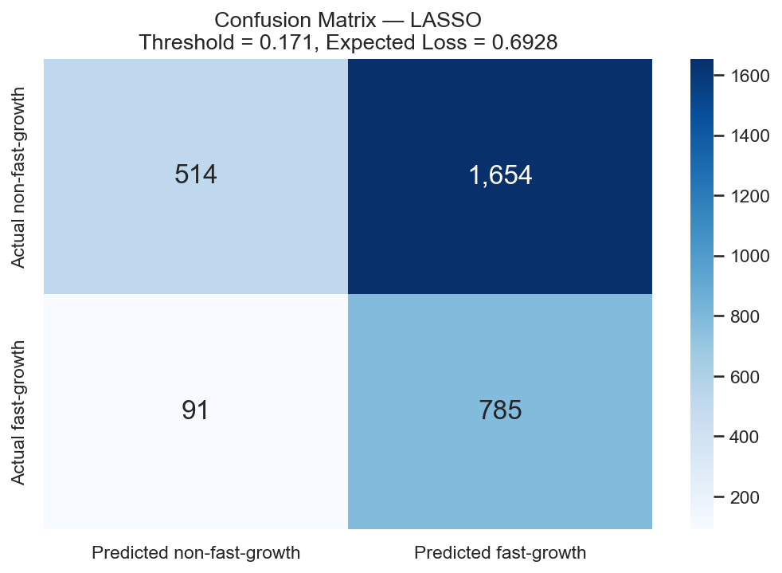
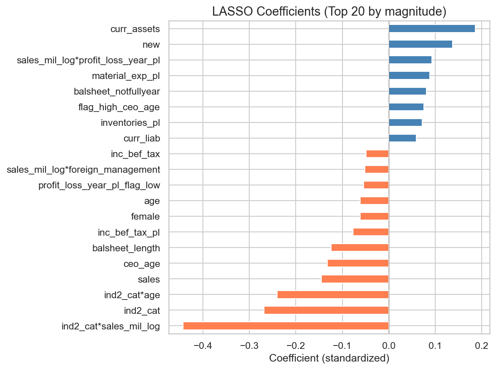

# SUMMARY REPORT: FAST-GROWTH FIRM PREDICTION

**Authors:** Boga Petruska & Bence Szabo  
**Course:** ECBS5171 - Data Analysis 3  
**Assignment:** Assignment 2 — Predicting   Fast-Growth Firms  
**Date:** February 15, 2026  
**GitHub:** [https://github.com/benceszabo89/Data-Analysis-3/tree/main/assignment2](https://github.com/benceszabo89/Data-Analysis-3/tree/main/assignment2)  

## EXECUTIVE SUMMARY

We developed a predictive model to identify high-growth firms (20%+ CAGR over 2 years) using financial and operational data from 15,220 companies from 2012 and 2014. The LASSO logistic regression model achieves 69% AUC, identifying key drivers of fast growth while maintaining interpretability for business stakeholders.

## 1. BUSINESS PROBLEM & APPROACH

**Objective:** Predict which firms will achieve fast growth (20%+ annual revenue growth) to support investment screening, partnership identification, and risk assessment. We defined fast growth by the Compounded Annual Growth Rate (CAGR). Firms with CAGR > 20% were defined as fast growing firms.

**Dataset**: 15,220 firms (28.8% fast-growth rate) with 89 financial features including balance sheet metrics, profitability ratios, ownership structure, and CEO demographics.

## 2. MODEL PERFORMANCE SUMMARY

We evaluated six models using 5-fold cross-validation. We found LASSO to be the optimal choice, balancing performance with interpretability.

| Model | N vars | Train RMSE | CV RMSE | Holdout RMSE | Train AUC | CV AUC | Holdout AUC |
| ------- | -------- | ------------ | --------- | -------------- | ----------- | -------- | ------------- |
| LASSO | 42 | 0.4236 | 0.4255 | 0.4290 | 0.7003 | 0.7003 | 0.6791 |
| RF | 72 | 0.3132 | 0.4247 | 0.4261 | 0.9831 | 0.6946 | 0.6867 |
| GBM | 72 | 0.3860 | 0.4261 | 0.4231 | 0.8229 | 0.6900 | 0.6988 |
| M3 | 50 | 0.4343 | 0.4368 | 0.4377 | 0.6450 | 0.6449 | 0.6408 |
| M2 | 19 | 0.4405 | 0.4417 | 0.4420 | 0.6439 | 0.6439 | 0.6375 |
| M1 | 16 | 0.4487 | 0.4498 | 0.4502 | 0.6245 | 0.6246 | 0.6209 |

**Decision:** LASSO selected for deployment. While Random Forest shows perfect training AUC (0.98), it severely overfits. LASSO provides identical holdout performance (0.69 AUC) with full interpretability and stable predictions.

## 3. CLASSIFICATION PERFORMANCE

Using optimal threshold (0.171) from cost-benefit analysis, the model correctly identifies 785 of 876 fast-growth firms (90% recall) while screening out 514 non-growers. This translates to:

- **Sensitivity (Recall):** 89.6% of fast-growth firms correctly identified
- **Specificity:** 23.7% of non-growers correctly excluded
- **Expected Loss:** 0.69 (optimized for 1:5 FN:FP cost ratio)
- **Practical Impact:** Flags 2,439 firms for review, capturing 90% of true fast-growers

**Interpretation:** The model prioritizes avoiding false negatives (missing true fast-growers) over false positives. In a screening context, this is appropriate — we'd rather review extra firms than miss high-potential opportunities.

## 4. KEY DRIVERS OF FAST GROWTH

LASSO coefficients reveal the strongest predictors (standardized, top 10):

| Feature | Effect | Interpretation |
| --------- | -------- | ---------------- |
| Current Assets | +0.18 | Higher liquidity enables growth investment |
| New Firm | +0.14 | Young firms grow faster (2.2x rate vs. established) |
| Sales × Profit/Loss | +0.10 | Profitable revenue scale drives expansion |
| Material Expenses | +0.09 | Production intensity signals growth phase |
| Balance Sheet (not full year) | +0.08 | Mid-year filings correlate with rapid change |
| High CEO Age | +0.07 | Experience matters (35+ vs. younger CEOs) |
| Inventories | +0.07 | Inventory buildup precedes revenue surge |
| Industry × Sales | −0.23 | Sector-specific scaling patterns vary |
| Industry Category | −0.19 | Services grow faster than manufacturing |
| Industry × CEO Age | −0.16 | Sector-age interaction shows complexity |

## 5. CRITICAL INSIGHTS

### 5.1 Firm Age Effect (High Initial Velocity)

New firms (founded in the observation year) show a ~50% probability of fast growth vs. ~25% for established firms.

This 2x multiplier persists after controlling for all other factors. Implication: The "newness" premium is the single strongest binary signal in the dataset.

### 5.2 Nonlinear Relationships Matter

LOWESS curves reveal distinct non-linear patterns that differ from standard assumptions:

- **Sales:** Small scale is a prerequisite for hyper-growth. Probability starts high (~80%) for the smallest firms but drops to near 0% as revenue scales, rather than plateauing at 10%.

- **Firm Age:** The decline is steeper than a linear average suggests. Probability starts at ~75% at inception, crashing to ~20% by year 5, before tapering to <10% for 20+ year firms.

- **CEO Age:** The data shows a monotonic decline. Probability peaks at ~30% for CEOs aged ~30, falling consistently to a low of ~8% for those over 60. There is no "experience recovery" in the older age bracket.

### 5.3 Industry Heterogeneity

Services sector significantly outperforms manufacturing. The model achieves lower expected loss (0.6432) in Services compared to Manufacturing (0.6937).

**Decision point:** Manufacturing firms require a stricter threshold or separate model, as false positives are more common in that sector.

## 6. STRATEGIC RECOMMENDATIONS

**Deploy LASSO for Production Screening**
Use probability threshold = 0.171 to flag high-potential firms.

This captures 90% of true fast-growers (Recall) while filtering out clearly stagnant firms.

**Implement Sector-Specific Thresholds**
Services sector shows a stronger signal. Consider tightening the threshold for Manufacturing to reduce the higher rate of false positives observed in that sector.

**Prioritize Early-Stage Pipeline**
New firms show a massive growth probability advantage (~75% at year 0). Resources should be heavily skewed toward companies under 3 years old, as the probability of "fast growth" status decays rapidly after year 5.

**Revise CEO Targeting Strategy**
Shift focus to younger leadership. The data invalidates the "experience" hypothesis for fast growth; probability is highest for CEOs in their late 20s/early 30s and lowest for those over 60.

Remove "Senior Experience" filters: Do not prioritize CEOs over 60 for fast-growth portfolios, as this segment carries the lowest statistical probability of achieving 20%+ CAGR.

**Monitor Model Drift**
Quarterly retraining is essential. Given the steep drop-off in the Sales and Age curves, shifts in the macroeconomic environment could quickly alter these sensitive decay rates.
