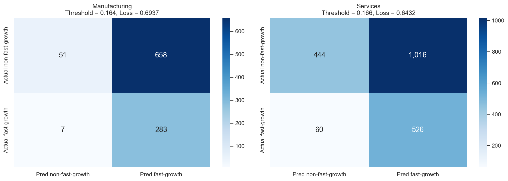

# Predicting Fast-Growth Firms - Technical Report

**Authors:** Boga Petruska & Bence Szabo  
**Course:** ECBS5171 - Data Analysis 3  
**Assignment:** Assignment 2 — Predicting Fast-Growth Firms 
**Date:** February 15, 2026  
**GitHub:** [https://github.com/b0glarka/Data-Analysis-3/tree/main/Assignment 2](https://github.com/b0glarka/Data-Analysis-3/tree/main/Assignment%202)

---

## 1. Introduction

This report documents the development of a predictive model for identifying fast-growth firms using the Bisnode panel dataset. The analysis consists of two parts. First, developing and comparing probability models to predict rapid firm growth, followed by a classification framework using an asymmetric loss function. Second, evaluating  model performance between the manufacturing and services sectors. The accompanying Jupyter notebooks—covering data preparation and modeling—are available in the linked repository.

---

## 2. Target Definition: Designing the Fast-Growth Label

### 2.1 Alternative definitions considered

There is no single standard for defining fast-growth firms. The literature offers several competing frameworks, and the choice of definition materially affects which firms are classified as high-growth and how useful the resulting predictions are. We evaluated four prominent approaches:

#### Definition A: OECD original (2007)
*20% annualized growth.* The 2007 OECD-Eurostat Manual on Business Demography Statistics defines high-growth enterprises as "all enterprises with average annualised growth greater than 20% per annum, over a three-year period," measured by either turnover or employment, with a minimum of 10 employees at the start of the observation period (OECD-Eurostat, 2007). This definition became the most widely adopted benchmark in the academic literature, precisely because having a standardized definition fostered comparability across studies and countries.

#### Definition B: Eurostat revised (2014)
*10% annualized growth.* In 2014, the European Commission lowered the threshold from 20% to 10% via Implementing Regulation (EU) No 439/2014. Under the current EU legal framework, a high-growth enterprise is one with average annualized growth in employees greater than 10% over a 3-year period, with at least 10 employees at the beginning of the growth period. This revision was motivated by pilot studies showing that the 20% threshold produced too few qualifying firms in many EU countries, creating statistical difficulties. The recent OECD literature now uses both thresholds side by side, referring to firms meeting the 10% criterion as "scalers" and reserving "high-growth" for firms exceeding 20% (OECD, 2021).

#### Definition C: Birch Index 
*combined absolute and relative growth.* Birch (1979, 1987) proposed a composite measure that multiplies absolute employment change by the ratio of end-to-start employment, which weights both absolute change (favoring large firms) and relative change (favoring small firms). This avoids the small-firm bias inherent in pure percentage growth measures, where a firm growing from 2 to 4 employees shows 100% growth but creates minimal economic impact. However, it requires reliable employment data, which is poorly covered in our dataset (`labor_avg` has substantial gaps).

### 2.2 Our choice: 20% OECD threshold with sales-based measurement

We adopt Definition A (the original OECD 20% threshold) with two adaptations: a 2-year window instead of 3 years, but dropping the 10-employee minimum. The revised Eurostat 10% threshold, while now the EU legal standard for reporting, would classify a much larger share of our sample as fast-growth (well above 40%), making the prediction task easier but economically less meaningful. A fund screening for growth-stage investments is not interested in firms growing at 10% — that barely exceeds inflation in many markets. The 20% cutoff yields approximately 29% fast-growth firms in our sample, which is balanced enough for modeling, avoids extreme class imbalance that plagues rare-event prediction but also remains selective enough to identify genuinely dynamic firms.

While the OECD recognizes both turnover and employment as valid growth metrics, sales-based measurement better captures market momentum and is more directly tied to firm value creation. Employment growth is a lagging indicator, in that firms typically expand headcount only after sustained revenue increases. Sales data is also more consistently reported in the Bisnode dataset, with fewer missing values than employment figures (`labor_avg` has substantial gaps). This choice also sidesteps the small-firm bias problem that motivated the Birch Index, since revenue growth is less susceptible to the mechanical inflation of percentage rates when the base is small.

### 2.3 Time window: 2-year CAGR (2012–2014)

The standard OECD definition uses a 3-year window. Our dataset spans 2010–2015 and we anchor predictions on the 2012 cross-section (consistent with the ch17 seminar code), leaving either a 1-year (2012 to 2013) or 2-year (2012 to 2014) forward window.

We chose the 2-year window for two main reasons grounded in corporate finance. First, a single year of high sales growth may reflect transitory shocks, such as a large contract, inventory restocking, or seasonal anomalies, rather than genuine firm-level dynamism. Second, a single year measure conflates true growth with mean-reversion: firms with temporarily depressed 2012 sales would appear as fast-growers simply by returning to normal levels. The 2-year CAGR smooths this base-year effect, producing a more reliable signal of genuine expansion.

### 2.4 Formula and class balance

The target variable is computed as:
```
growth["cagr_2y"] = (growth["sales_2014"] / growth["sales_2012"]) ** 0.5 - 1
growth["fast_growth"] = (growth["cagr_2y"] >= 0.20).astype(int)
```
The OECD definition does not require 20% growth in each individual year: a firm growing 10% one year and 35% the next qualifies, so long as the compound annualized rate over the full period exceeds 20% (OECD-Eurostat, 2007). This threshold yields a ~29% fast-growth rate in our sample. We verified this against alternative thresholds (10%, 15%, 25%); the 20% cutoff sits at a natural break point in the CAGR distribution.

## 3. Data Preparation

### 3.1 Sample design

We start from the raw panel file `cs_bisnode_panel.csv`, following the ch17 pipeline as a template. The panel is filtered to 2010–2015 and balanced so that all firm x year combinations exist. The modeling cross-section is anchored at 2012, with sample restrictions matching ch17: firms alive in 2012 with sales between €1,000 and €10 million. After merging 2014 sales for label construction and dropping firms with missing or non-positive sales in either year, the final dataset contains 15,220 firms.

### 3.2 Columns dropped

9 columns were dropped due to >50% missing values: `D`, `finished_prod`, `wages`, `COGS`, `net_exp_sales`, `net_dom_sales`, `exit_year`, `exit_date`, and `labor_avg`. We validated the missing patterns before removal to confirm these were structurally absent rather than informatively missing.

### 3.3 Feature engineering

Feature engineering follows the ch17 template with adaptations for the fast-growth prediction task. We constructed 72 predictor variables organized into the following categories:

**Sales transformations.** Log sales (`sales_mil_log`) and its square to capture non-linear scale effects.

**Balance sheet ratios.** Key items (fixed assets, liquid assets, current assets, intangible assets, share equity, subscribed capital) normalized by total assets. This captures firm structure independently of scale. A quadratic term for share equity ratio captures potential non-linear effects (e.g., both very low and very high equity ratios may signal different risk profiles).

**P&L ratios.** Income statement items (extra expenses/income, profit/loss, income before tax, inventories, material expenses, personnel expenses) normalized by sales, capturing operational efficiency and cost structure.

**Flag variables and winsorization.** Binary indicators for extreme values (below 1st or above 99th percentile) and zero/error values in financial ratios. After flagging, ratios are winsorized to the 1st/99th percentile. This dual approach preserves outlier information as a signal while preventing extreme values from distorting model estimates.

```python
def flag_and_winsorize(df, varname):
    """Flag outliers and zero values, winsorize to 1st/99th pctile."""
    p01 = df[varname].quantile(0.01)
    p99 = df[varname].quantile(0.99)
    df[f"{varname}_flag_low"] = (df[varname] < p01).astype(int)
    df[f"{varname}_flag_high"] = (df[varname] > p99).astype(int)
    df[varname] = df[varname].clip(lower=p01, upper=p99)
```

**Firm characteristics.** Firm age, age-squared (non-linear lifecycle effects), CEO age, foreign management flag, gender indicator, new firm dummy (age ≤ 1), and urban location.

**Industry and region categories.** NACE 2-digit codes collapsed into broader groups (following ch17: codes <26→20, 31→30, 36-54→40, >56→60, missing→99). Region encoded as categorical variable.

**Interaction terms.** Eight interaction variables capturing cross-effects identified during exploratory analysis:

```python
interactions = [
    ("ind2_cat", "age"), ("ind2_cat", "age2"),
    ("ind2_cat", "sales_mil_log"), ("ind2_cat", "ceo_age"),
    ("ind2_cat", "foreign_management"),
    ("sales_mil_log", "age"),
    ("sales_mil_log", "profit_loss_year_pl"),
    ("sales_mil_log", "foreign_management"),
]
```

The industry x age and industry x sales interactions are motivated by the observation from exploratory analysis that the relationship between firm characteristics and growth rates varies substantially across sectors. For instance, young firms in services show much higher growth rates than young firms in manufacturing. This is an effect that additive models cannot capture.

### 3.4 Exploratory analysis highlights

Descriptive statistics by target group and summary tabulations guided feature engineering decisions. Firm age emerged as a strong signal: new firms (age ≤ 1) show markedly higher fast-growth rates than established firms, motivating the `new` dummy and age-squared term. Smaller firms also exhibit higher growth probabilities, consistent with the corporate finance intuition that percentage growth is easier from a lower base. Fast-growth rates vary across industry categories, which motivated the industry interaction terms.

---

## 4. Model Building and Probability Prediction

### 4.1 Train/holdout split and cross-validation

We use an 80/20 stratified train/holdout split and 5-fold stratified cross-validation. Stratification ensures each fold and the holdout set preserve the ~29% fast-growth rate, producing more stable performance estimates.

```python
data_train, data_holdout = train_test_split(
    data, test_size=0.2, random_state=42, stratify=data["fast_growth"]
)
k = StratifiedKFold(n_splits=5, shuffle=True, random_state=42)
```

### 4.2 Model specifications

We fit six models with progressively increasing complexity:

| Model | Description | N predictors |
|-------|-------------|:------------:|
| M1 | Logit with raw financials only | 16 |
| M2 | Logit + balance sheet quality flags | 19 |
| M3 | Logit + engineered ratios, squared terms, flags | 50 |
| LASSO | L1-regularized logit with full feature set incl. interactions | 42 (non-zero) |
| RF | Random Forest with full feature set | 72 |
| GBM | Gradient Boosting with full feature set | 72 |

**Logit models (M1–M3)** are fitted using `LogisticRegressionCV` with no regularization (`Cs=[1e20]`), matching the ch17 approach. These establish baselines at different complexity levels.

**LASSO** uses L1-penalized logistic regression with a grid of 10 lambda values. Features are standardized before fitting (required for penalization to work correctly). LASSO performs automatic feature selection, shrinking 72 inputs to 42 non-zero coefficients.

```python
lambdas = list(10 ** np.arange(-1, -4.01, -1/3))
C_values = [1 / (l * n_obs) for l in lambdas]

...

lasso_model = LogisticRegressionCV(
    Cs=C_values, penalty="l1", cv=k, refit=True, scoring="neg_brier_score",
    solver="liblinear", random_state=random_seed
)

```
**Random Forest** uses 500 trees with grid search over `max_features` (5, 7, 9) and `min_samples_split` (11, 16, 21).

**Gradient Boosting** uses 500 boosting rounds with grid search over `max_depth` (3, 5), `learning_rate` (0.05, 0.1), and `min_samples_split` (11, 16).

### 4.3 Probability prediction results


Key observations: LASSO achieves the highest CV AUC (0.70) with zero overfitting (Train AUC ≈ CV AUC). RF has the best CV RMSE but massively overfits (Train AUC 0.98 vs. CV 0.69). GBM shows moderate overfitting (Train 0.82 vs. CV 0.69). The progression from M1→M3→LASSO confirms that additional features and regularization both help, but with diminishing returns.

---

## 5. Classification

### 5.1 Loss function design

We frame the problem as an investment fund screening firms for growth-stage financing:

- **False Negative (FN = $5):** Missing a fast-growth firm means lost upside from a high-return deal. Fast-growth firms represent outsized return potential — the venture capital literature shows that portfolio returns are driven by a small number of "home runs," making each missed opportunity disproportionately costly.
- **False Positive (FP = $1):** Flagging a non-grower only wastes due diligence resources (analyst time, site visits, financial review), but this cost is bounded and recoverable.

We therefore set FN = 5 and FP = 1 in arbitrary cost units, implying that missing a true fast-grower is five times as costly as evaluating a non-grower. The 5:1 cost ratio reflects the asymmetry typical of growth-stage investing: the expected upside of identifying a genuine fast-grower substantially exceeds the cost of investigating a false lead. 

### 5.2 Optimal threshold selection

For each model, we search for the classification threshold that minimizes expected loss using the ch17 approach: on each CV fold, we compute ROC curve coordinates and find the threshold that minimizes:

```
Expected Loss = (FP × 1 + FN × 5) / N
```

For logit-based models (M1–M3, LASSO), we use the `generate_fold_prediction()` function to extract per-fold coefficients from `coefs_paths_`, ensuring proper out-of-fold predictions. For RF and GBM, we refit the model on each fold's training data since these models don't expose per-fold coefficient paths.

### 5.3 Classification results


**LASSO wins** with the lowest CV expected loss (0.6594). All optimal thresholds are well below the ~29% base rate, reflecting the asymmetric loss function that penalizes missed fast-growers 5× more than false alarms.

### 5.4 Best model: LASSO — holdout evaluation

**Confusion matrix (LASSO, holdout set, threshold = 0.171):**


- Precision: 32.2% — Recall: 89.6% — Accuracy: 42.7%
- Holdout expected loss: 0.693

The model deliberately trades precision (32%) for recall (89.6%) because our loss function penalizes missed fast-growers 5× more than false alarms. The total expected loss on holdout is 0.693 per firm. Of the 876 actual fast-growth firms, we catch 785 (90%), which is a useful screening rate for an investment fund willing to absorb due diligence costs on false positives.

The 1,654 false positives may seem high, and this is a direct consequence of the 5:1 cost ratio. A lower FN/FP ratio (e.g. 2:1) would raise the threshold and reduce false alarms, but at the cost of missing more fast-growth firms. The appropriate ratio is ultimately a business decision depending on how costly missed opportunities are relative to screening costs.  

### 5.5 Why LASSO over RF/GBM?

Beyond marginally better expected loss, LASSO offers two critical advantages:

1. **Stability.** Train and CV AUC are virtually identical (~0.70), meaning the model generalizes reliably. RF overfits severely (Train AUC 0.98 vs. CV 0.69) and GBM moderately (0.82 vs. 0.69). In production, stability matters more than marginal performance gains.

2. **Interpretability.** LASSO coefficients reveal which variables drive predictions and in which direction — something tree-based models cannot provide. For a screening tool where stakeholders need to understand *why* a firm is flagged, this transparency is essential.

### 5.6 Key predictors (LASSO coefficients)


The top LASSO coefficients reveal economically intuitive patterns:

- **Positive:** `curr_assets` (liquidity enables growth investment), `new` firm flag (young firms have highest growth potential), `sales_mil_log*profit_loss_year_pl` (profitable firms with scale convert revenue into growth), `material_exp_pl` (higher material costs may indicate production scaling).
- **Negative:** `ind2_cat*sales_mil_log` (the size-growth relationship varies across industries — larger firms in certain sectors grow more slowly), `ind2_cat` (baseline industry effects), `sales` (larger firms have lower growth rates — consistent with the "law of large numbers" in corporate finance), `balsheet_length` and `ceo_age` (longer reporting histories and older management correlate with maturity, not expansion).

### 5.7 Limitations

AUC of 0.70 reflects moderate discriminatory power. Firm growth depends heavily on unobservable factors — market opportunities, innovation capacity, management quality, competitive dynamics — that financial statements cannot capture. The model is useful as a screening tool to narrow down candidates, not as a definitive predictor of which firms will grow fast.

---

## 6. Task 2: Industry Comparison

### 6.1 Setup

We apply the same LASSO pipeline and loss function (FP=1, FN=5) separately to manufacturing (NACE 10–33, N=4,992) and services (NACE 55–56: accommodation & food, N=10,228). Both subsamples have similar fast-growth rates (~29%).

### 6.2 Results

**Industry Comparison:**


**Confusion matrices:**



### 6.3 Discussion

LASSO performs notably better on services (CV AUC 0.72, holdout loss 0.64) than manufacturing (CV AUC 0.65, holdout loss 0.69). The services sample is twice as large and retains more non-zero LASSO coefficients (44 vs 30), suggesting richer signal in the data.

Thresholds are similar (~0.165 for both), but the confusion matrices reveal different screening profiles. Manufacturing screens out only 51 of 999 holdout firms — the model flags nearly everyone. Services provides more useful filtering, eliminating ~444 firms while missing 60 fast-growers. In practice, LASSO is a useful screening tool for services firms but offers limited discriminatory value for manufacturing, where growth likely depends on sector-specific factors not captured by general financial ratios.

---

## 7. Reproducibility

All code is available at the linked GitHub repository. To reproduce:

```bash
pip install -r requirements.txt

```

---

## References

Birch, D.L. (1979). *The Job Generation Process.* MIT Program on Neighborhood and Regional Change.

Birch, D.L. (1987). *Job Creation in America.* New York: Free Press.

European Commission (2014). *Commission Implementing Regulation (EU) No 439/2014.* Official Journal of the European Union.

OECD (2021). *Understanding Firm Growth: Scale-ups and High-Growth Firms.* OECD Studies on SMEs and Entrepreneurship. Paris: OECD Publishing.

OECD-Eurostat (2007). *Manual on Business Demography Statistics.* Paris: OECD Publishing. Available at: https://www.oecd.org/sdd/business-stats/39974460.pdf
